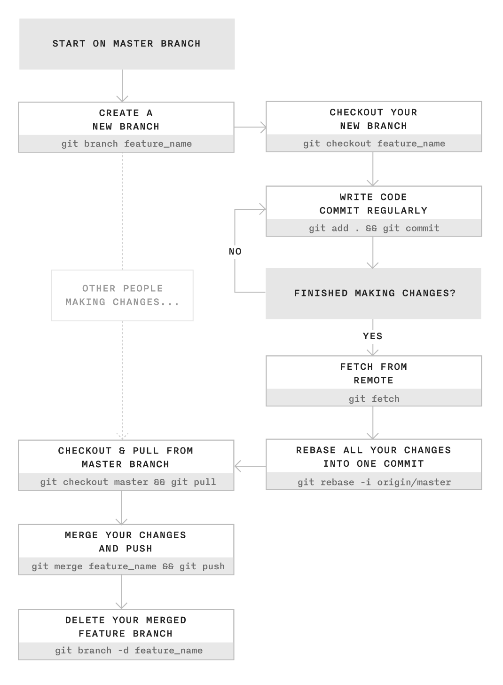
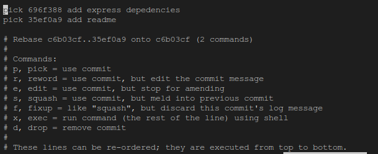

# Git for Teams
This repository will tell and explain how to make your daily code activity using version control system more efficient and clean.

## Prerequisites
```
    Installed git on your system
    Have basics understanding how git works
```

IF you still don't have the prerequisites please to learn more about git and basic use of it.

## Workflow
Before I give the workflow, I must say thank you to [James Chambers](http://jameschambers.co/writing/git-team-workflow-cheatsheet/) that make a great article about Git for Teams.
This the workflow explained by him



1. You create new branch on your local machine with rules namealias_feature name
```
    git branch alias_featurename
    git checkout alias_featurename
```

2. Regularly you code and do git add . & git commit into namealias_featurename.
```
    git add .
    git status // to check and list your new code
    git commit -m 'message'
```

3. If you think your code done as well, then we must do git fetch to make sure our code in local machine is uptodate with latest code in git repository.
```
    git fetch origin master
```

4. Now you'll rebase your changes into the master branch. This effectively condenses down all the commits you've made on your feature branch (jc_feature_name) into one commit. 
```
    git rebase -i origin/master
```

This will open an interactive rebase tool, which shows all the commits you've made on your branch. You'll then "squash" all your changes into one commit.

To do this, replace pick with s for all but the top commit. s is shorthand for squash - imagine all the changes you've made being "squashed" up into the top commit.


5. Switch to the master branch in preparation of merging your changes. When merging always remember that you're merging into the branch you're currently on.
```
    git checkout master

    git merge alias_featurename

    git push origin master
```

6. With your changes merged into the master branch, you can safely delete your feature branches.
```
    # Delete remote feature branch (the colon is important!)
    git push origin :jc_feature_name

    # Delete local branch
    git branch -d jc_feature_name

```


## Notes
For more complex and successful Git branch model you can read carefully this article written by [Vincent Driessen](http://nvie.com/posts/a-successful-git-branching-model/)